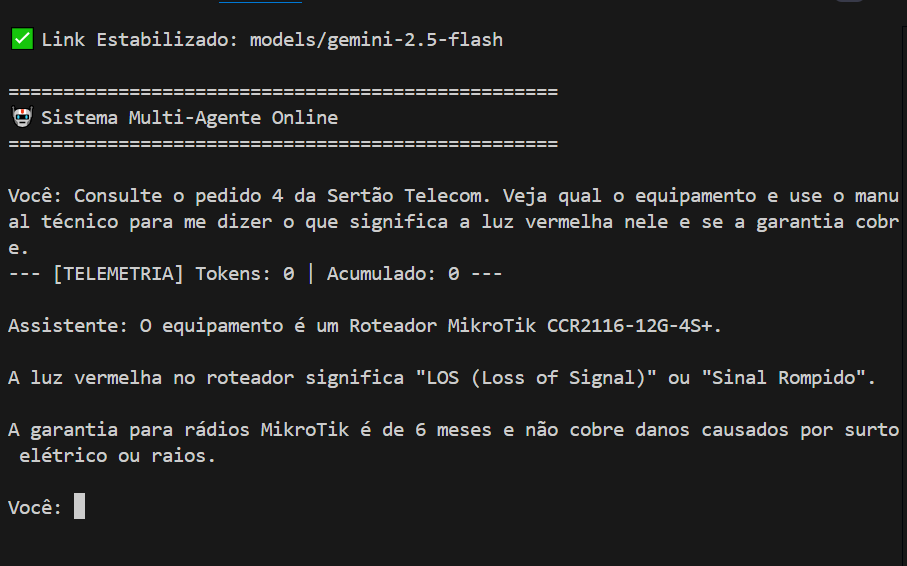

# 🤖 ERP Multi-Agent: Inteligência Artificial com Orquestração LangGraph & RAG

Este projeto consiste em um **Agente de IA Autônomo** de nível empresarial que integra operações de um **ERP Relacional** com uma **Base de Conhecimento Técnica (RAG)**. O sistema utiliza grafos de estado para gerenciar o fluxo de conversação, permitindo que a IA tome decisões executáveis para resolver problemas de infraestrutura de rede, logística e suporte técnico.

# Demonstração do Sistema:

## 🏗️ Diferenciais de Engenharia

O projeto foi construído com foco em **resiliência, observabilidade e persistência**, aplicando conceitos de infraestrutura de TI no desenvolvimento de software:

*   **RAG Analítico (Retrieval-Augmented Generation):** Integração de uma base de conhecimento em Markdown via vetores (FAISS). A IA consulta manuais de MikroTik, Cisco Nexus e terminais satelitais ORBCOMM para fornecer diagnósticos precisos.
*   **Monitor de Telemetria (FinOps):** Rastreamento em tempo real do consumo de tokens por chamada e acumulado da sessão, permitindo controle rigoroso de custos operacionais e uso de API.
*   **Nó de Auto-Correção (Self-Healing):** Lógica de resiliência onde o agente detecta falhas em consultas SQL ou buscas e tenta corrigir a própria lógica antes de retornar ao usuário, reduzindo alucinações.
*   **Memória Persistente (Stateful Design):** Implementação de `MemorySaver` via LangGraph. O agente mantém o contexto de threads específicas, permitindo perguntas de acompanhamento sem repetição de dados anteriores.
*   **Scanner Dinâmico de Modelos (Failover):** Lógica de "Handshake" que realiza o scanner dos modelos disponíveis na API do Google, garantindo o funcionamento contínuo mesmo com variações de cota.

## 🔭 Observabilidade & Interface

O sistema prioriza a clareza operacional através de um dashboard CLI:
1.  **⚙️ Roteador:** Logs em tempo real indicando qual ferramenta (ERP ou RAG) está sendo acionada.
2.  **📊 Telemetria:** Exibição imediata do custo da rodada e saldo acumulado na sessão atual.
3.  **✅ Status:** Confirmação visual de conexão e estabilidade do sistema multi-agente.

## 🛠️ Stack Tecnológica

*   **Linguagem:** Python 3.13
*   **Framework de Agentes:** LangChain & LangGraph (Orquestração de estados)
*   **Cérebro (LLM):** Google Gemini Series (via Google AI Studio)
*   **Vector Database:** FAISS com Embeddings locais `all-MiniLM-L6-v2`
*   **Banco de Dados:** SQLite (ERP Relacional e Data Warehouse de Telemetria)

## 📂 Estrutura do Ecossistema

*   `multi_agent.py`: Núcleo do agente com lógica de persistência, telemetria e auto-correção.
*   `data/manuais.md`: Base de conhecimento estruturada com metadados de hardware e matrizes de troubleshooting.
*   `erp_mock.db`: Banco de dados relacional com registros de clientes, pedidos e status logístico.
*   `requirements.txt`: Lista consolidada de dependências para o ambiente de produção.

## 🚀 Como Executar

1.  **Clone o repositório:**
    ```bash
    git clone [https://github.com/seu-usuario/erp-multi-agent.git](https://github.com/seu-usuario/erp-multi-agent.git)
    cd erp-multi-agent
    ```

2.  **Configure as Variáveis de Ambiente:**
    Crie um arquivo `.env` na raiz:
    ```env
    GOOGLE_API_KEY=sua_chave_aqui
    ```

3.  **Instale as Dependências:**
    ```bash
    pip install -r requirements.txt
    ```

4.  **Inicie o Agente:**
    ```bash
    python multi_agent.py
    ```

---
**Conectando Redes e IA:** Este repositório reflete a aplicação de conceitos de infraestrutura (como redundância, telemetria de custos e auto-correção) no desenvolvimento de soluções modernas de IA Generativa.
